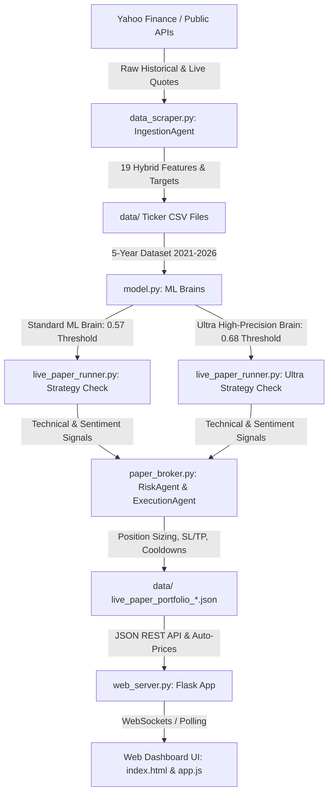

# 🚀 TradingBOT: Quantitative Multi-Agent Algorithmic Trading Terminal

> **A multi-agent, machine learning-driven paper trading terminal pre-trained on 5 years of historical data (2021–2026) across top Nifty 50 companies.**

---

<!-- LIVE_METRICS_START -->
## 📈 Live Portfolio Performance Metrics

> **Last Auto-Synced:** `2026-08-14 09:44:11 IST`

| Strategy Profile | Initial Capital | Valuation | Cash Balance | Net Return | Win Rate | Open Positions | Closed Trades |
| :--- | :--- | :--- | :--- | :--- | :--- | :--- | :--- |
| **🚀 5-Year Macro Trend (0.57 Threshold)** | INR 100,000.00 | **INR 103,301.91** | INR 113.95 | **`+3.30%`** 🟢 | **`100.0%`** | 7 | 3 |
| **🎯 Ultra-High Conviction (0.68 Threshold)** | INR 100,000.00 | **INR 100,000.00** | INR 100,000.00 | **`+0.00%`** ⚪ | **`0.0%`** | 0 | 0 |
| **📜 Legacy Account** | INR 100,000.00 | **INR 98,208.62** | INR 619.85 | **`-1.79%`** 🔴 | **`0.0%`** | 4 | 1 |
<!-- LIVE_METRICS_END -->

---

## 📌 Project Overview

**TradingBOT** is an end-to-end quantitative paper trading platform powered by machine learning and modular AI agents. It fetches historical daily and intraday market quotes, engineers 19 technical and fundamental hybrid features, trains custom XGBoost classification models, and executes automated multi-profile trading strategies.

The system features a **Multi-Profile Architecture** that runs three distinct portfolio strategies simultaneously every 10 seconds, backed by a multi-threaded Flask web dashboard.

---

## 🏗️ Architecture & Component Workflow



### Modular Component Breakdown

1. **`data_scraper.py` (`IngestionAgent`)**
   * Downloads 5 years of daily quotes (2021–2026) for Nifty 50 blue chips (`RELIANCE`, `TCS`, `INFY`, `HDFCBANK`, `ICICIBANK`, `SBIN`, `ITC`, `LT`, `BHARTIARTL`, `WIPRO`).
   * Computes technical indicators (SMA, RSI, MACD, Bollinger Bands, ATR, ROC) and matches fundamental balance sheet metrics (`Net_Profit_Margin`, `Debt_to_Equity`).
   * Generates dual targets:
     * `Target`: 1 if price increases >= +0.30% over the next 2 trading days.
     * `Target_Ultra`: 1 if price increases >= +0.60% over the next 2 trading days.

2. **`model.py` (`StrategyAgent` & `UltraStrategyAgent`)**
   * **Standard Brain (`StrategyAgent`):** Trains an XGBoost Classifier on 5-year historical data using `scale_pos_weight` to offset class imbalance. Optimized for balanced F1-score with a `0.57` threshold.
   * **Ultra High-Precision Brain (`UltraStrategyAgent`):** Inherits from `StrategyAgent`, trained specifically on `Target_Ultra` (>= +0.60% upside) using regularized parameters (`min_child_weight=3`, `colsample_bytree=0.8`, `subsample=0.8`) with a `0.68` confidence threshold.

3. **`paper_broker.py` (`ExecutionAgent` & `RiskAgent`)**
   * **`RiskAgent`:** Enforces stop-loss, trailing stop-loss, and take-profit thresholds. Dynamically sizes positions using a **Half-Kelly Criterion Sizing Engine** and recycles funds using an automated **Portfolio Pruning & Capital Recycling Engine**.
   * **`ExecutionAgent`:** Simulates order execution with realistic dynamic slippage (liquidity/volatility-based) and brokerage fees/taxes (0.12%). Manages averaging-down rules (max 2 buys per stock on >= 0.3% price drop) and provides a wrapper `place_buy_order` to invoke capital recycling before rejecting a trade.

4. **`live_paper_runner.py`**
   * Main agent loop executing live market scans.
   * Downloads batch 1-minute live quotes using `fetch_batch_live_prices`.
   * Evaluates trend filters (Daily 50 SMA filter), micro-dip entry filters (`RSI < 65` or `RSI < 58`), and RSS news headline sentiment before dispatching buy/sell orders.

5. **`web_server.py` & Web UI (`templates/index.html`, `static/app.js`)**
   * Multi-threaded Flask REST server (`threaded=True`).
   * Background scheduler running market scans across all active profiles every 10 seconds.
   * Serves live portfolio state, interactive Chart.js stock charts, trade ledgers, and live agent log streams.

---

## 📊 Multi-Profile Strategy Matrix

The system runs **3 concurrent paper trading profiles** simultaneously:

| Feature / Strategy | 📜 Legacy Account | 🚀 5-Year Macro Trend | 🎯 Ultra-High Conviction (NEW) |
| :--- | :--- | :--- | :--- |
| **Starting Balance** | Legacy Holdings (HDFC, etc.) | INR 100,000 | **INR 100,000 (Fresh)** |
| **ML Engine** | Standard Brain (`StrategyAgent`) | Standard Brain (`StrategyAgent`) | **Dedicated `UltraStrategyAgent`** |
| **Target Upside** | >= +0.30% in 2 days | >= +0.30% in 2 days | **>= +0.60% in 2 days (`Target_Ultra`)** |
| **ML Buy Threshold** | `0.57` | `0.57` | **`0.68` (High Confidence)** |
| **Stop Loss (SL)** | `5.0%` | `5.0%` | **`3.0%` (Tighter Protection)** |
| **Take Profit (TP)** | `5.0%` | `5.0%` | **`4.0%` (Quicker Lock-in)** |
| **Trend Filter** | Daily 50 SMA | Daily 50 SMA | **Daily 50 SMA** |
| **Intraday Dip Filter** | `RSI < 65` | `RSI < 65` | **`RSI < 58` (Pullback Entries Only)** |
| **Position Sizing** | Dynamic Half-Kelly Sizing | Dynamic Half-Kelly Sizing | **Dynamic Half-Kelly Sizing** |
| **Capital Recycling** | N/A (Not Ultra) | N/A (Not Ultra) | **Automated Portfolio Pruning (>=10% delta)** |

---

## 📈 Feature Engineering Pipeline (24 Features)

Each sample vector $X_t$ consists of:

1. **Price & Volume:** `Close`, `Volume`, `Volume_Ratio` (Volume / 20-period SMA Volume)
2. **Moving Averages:** `MA50`, `MA200`, `Dist_MA50`, `Dist_MA200`
3. **Momentum Indicators:** `RSI14`, `ROC_10` (10-period Rate of Change)
4. **MACD Oscillators:** `MACD`, `MACD_Signal`, `MACD_Hist`
5. **Volatility Bands:** `BB_Upper_Dist`, `BB_Lower_Dist`, `BB_Width`, `ATR`, `ATR_Ratio`
6. **Financial Fundamentals:** `Net_Profit_Margin`, `Debt_to_Equity`
7. **Hybrid Sentiment (20th Feature):** `Global_Sentiment_Score` (Blends 70% daily Gemini 2.5 Flash bias macro score + 30% real-time GDELT news FinBERT sentiment micro score)
8. **Floor Pivot Points (NEW):** `Dist_P`, `Dist_R1`, `Dist_R2`, `Dist_S1`, `Dist_S2` (Normalized percentage distance from the current Close to the previous period's Pivot Point, Resistance, and Support levels)

---

## 🛡️ Risk & Execution Rules

1. **Position Sizing:** Allocation = min(Current Cash, Initial Capital * 0.10).
2. **Slippage & Fees:**
   * Buy Execution Price = Current Price * 1.0005 (+0.05% buy slippage).
   * Sell Execution Price = Current Price * 0.9995 (-0.05% sell slippage).
   * Transaction Taxes & Brokerage = 0.12% of total trade value.
3. **Averaging Down Rule:** If position is already open and price drops >= 0.30% from entry, the bot allows **one additional averaging buy** (max 2 entries total).
4. **2-Day Cooldown:** Selling a position locks that ticker for 2 full trading days to prevent revenge trading / churn.
5. **HODL Safety Override (NEW):** Stop-loss and trailing stop-loss checks are disabled to prevent selling at a loss during temporary market drawdowns. Positions will only close on positive Take-Profit breaches.

---

## 📂 Repository File Structure

```
TradingBOT/
├── data/                            # Processed CSVs & portfolio state JSONs
│   ├── RELIANCE.NS_hybrid_features.csv
│   ├── live_paper_portfolio_ultra.json
│   ├── live_paper_portfolio_macro.json
│   └── live_paper_portfolio_legacy.json
├── templates/
│   └── index.html                   # HTML5 Web Terminal Dashboard
├── static/
│   ├── app.js                       # Frontend JavaScript (Chart.js & API polling)
│   └── style.css                    # Dark Glassmorphism CSS styles
├── data_scraper.py                  # IngestionAgent: Downloads data & engineers features
├── model.py                         # StrategyAgent & UltraStrategyAgent ML models
├── paper_broker.py                  # ExecutionAgent & RiskAgent simulation engines
├── live_paper_runner.py             # Live trading scan loop execution script
├── agent_coordinator.py             # Historical backtest simulation coordinator
├── web_server.py                    # Multi-threaded Flask Web Dashboard REST server
└── README.md                        # Documentation & AI Improvement Guide
```

## 💸 Capital Management & Risk Mechanics (New)

The bot utilizes a dynamic, probability-driven money management suite inside `RiskAgent` to optimize capital efficiency:

1. **Half-Kelly Sizing Engine (`calculate_kelly_allocation`):**
   * Computes payout ratio $b = \text{tp\_pct} / \text{sl\_pct}$.
   * Calculates the full Kelly fraction: $f = p - \frac{1 - p}{b}$ where $p$ is the model's confidence probability.
   * Leverages a conservative **Half-Kelly** sizing scale ($0.5 \times f$) to avoid over-leveraging.
   * Enforces a **2% allocation floor** (to ensure minimal entry sizes) and a **20% allocation ceiling** (to limit exposure per position).

2. **Automated Portfolio Pruning & Capital Recycling (`rebalance_for_high_conviction`):**
   * If a high-conviction buy signal is received (confidence $\ge 68\%$, Ultra Strategy) but the account lacks liquid cash to fund it, the bot will scan currently open positions.
   * It identifies the weakest open holding (lowest confidence entry score; ties broken by lowest unrealized return).
   * If the new incoming signal's confidence is **at least 10% higher** than the weakest open position's confidence, the weak position is forcefully sold immediately to recycle the capital.

3. **200 DMA Dynamic Confidence Threshold Scaling (NEW):**
   * If the current asset price drops below its 200-period Moving Average (200 DMA), the required XGBoost prediction threshold is dynamically scaled up to demand higher conviction:
     $$\text{Dynamic Threshold} = \text{Base Threshold} + (\text{Drop Pct} \times 1.5)$$
   * Capped at a maximum threshold of `0.85` to maintain entry feasibility and protect the portfolio from catch-a-falling-knife signals.

---

## ⚙️ Installation & Running Locally

### Prerequisites
* Python 3.10+
* Virtual Environment setup

### 1. Clone Repository & Install Dependencies
```bash
git clone https://github.com/Pranav2-4-7/trading_bot.git
cd trading_bot
pip install -r requirements.txt
```

### 2. Ingest Data & Engineer Features
```bash
python data_scraper.py
```

### 3. Run Historical Simulation / Backtest
```bash
python agent_coordinator.py
```

### 4. Launch Live Web Terminal
```bash
python web_server.py
```
Open **[http://127.0.0.1:5000/](http://127.0.0.1:5000/)** in your web browser.

---

## 🔮 AI Improvement & Extension Roadmap

*If you are providing this repository to an AI agent or LLM to improve the codebase, here are the recommended areas of enhancement:*

1. **Deep Learning Sequence Models (LSTM / Transformer / Temporal Fusion Transformer):**
   * Replace/augment XGBoost with an LSTM or Transformer model capable of capturing long-term temporal dependencies across multiple candle lookbacks.
2. **Reinforcement Learning Execution (PPO / Deep Q-Learning):**
   * Train a Proximal Policy Optimization (PPO) agent that learns adaptive exit strategies (dynamic SL/TP) based on real-time volatility.
3. **Order Book Microstructure & Level-2 Quote Integration:**
   * Incorporate bid-ask spread depth, order flow imbalance, and volume delta to optimize intraday execution timing.
4. **FinBERT / LLM Multi-Modal Sentiment Parsing:**
   * Upgrade the basic RSS headline sentiment matching to a fine-tuned FinBERT embeddings pipeline to classify financial news context dynamically.


<!-- commit-bot-update -->
### 🤖 Automated Telemetry Status
- Heartbeat pulse checked at: `8/18/2026, 11:43:42 PM`


<!-- commit-bot-update -->
### 🤖 Automated Telemetry Status
- Heartbeat pulse checked at: `8/18/2026, 11:43:42 PM`


<!-- commit-bot-update -->
### 🤖 Automated Telemetry Status
- Heartbeat pulse checked at: `8/18/2026, 11:43:42 PM`


<!-- commit-bot-update -->
### 🤖 Automated Telemetry Status
- Heartbeat pulse checked at: `8/18/2026, 11:43:43 PM`


<!-- commit-bot-update -->
### 🤖 Automated Telemetry Status
- Heartbeat pulse checked at: `8/18/2026, 11:43:43 PM`


<!-- commit-bot-update -->
### 🤖 Automated Telemetry Status
- Heartbeat pulse checked at: `8/18/2026, 11:43:43 PM`


<!-- commit-bot-update -->
### 🤖 Automated Telemetry Status
- Heartbeat pulse checked at: `8/18/2026, 11:43:44 PM`


<!-- commit-bot-update -->
### 🤖 Automated Telemetry Status
- Heartbeat pulse checked at: `8/18/2026, 11:43:44 PM`


<!-- commit-bot-update -->
### 🤖 Automated Telemetry Status
- Heartbeat pulse checked at: `8/18/2026, 11:43:44 PM`


<!-- commit-bot-update -->
### 🤖 Automated Telemetry Status
- Heartbeat pulse checked at: `8/18/2026, 11:43:44 PM`


<!-- commit-bot-update -->
### 🤖 Automated Telemetry Status
- Heartbeat pulse checked at: `8/18/2026, 11:43:45 PM`


<!-- commit-bot-update -->
### 🤖 Automated Telemetry Status
- Heartbeat pulse checked at: `8/18/2026, 11:43:45 PM`


<!-- commit-bot-update -->
### 🤖 Automated Telemetry Status
- Heartbeat pulse checked at: `8/18/2026, 11:43:45 PM`


<!-- commit-bot-update -->
### 🤖 Automated Telemetry Status
- Heartbeat pulse checked at: `8/18/2026, 11:43:45 PM`


<!-- commit-bot-update -->
### 🤖 Automated Telemetry Status
- Heartbeat pulse checked at: `8/18/2026, 11:43:46 PM`


<!-- commit-bot-update -->
### 🤖 Automated Telemetry Status
- Heartbeat pulse checked at: `8/18/2026, 11:43:46 PM`


<!-- commit-bot-update -->
### 🤖 Automated Telemetry Status
- Heartbeat pulse checked at: `8/18/2026, 11:43:46 PM`


<!-- commit-bot-update -->
### 🤖 Automated Telemetry Status
- Heartbeat pulse checked at: `8/18/2026, 11:43:47 PM`


<!-- commit-bot-update -->
### 🤖 Automated Telemetry Status
- Heartbeat pulse checked at: `8/18/2026, 11:43:47 PM`


<!-- commit-bot-update -->
### 🤖 Automated Telemetry Status
- Heartbeat pulse checked at: `8/18/2026, 11:43:47 PM`


<!-- commit-bot-update -->
### 🤖 Automated Telemetry Status
- Heartbeat pulse checked at: `8/18/2026, 11:43:47 PM`


<!-- commit-bot-update -->
### 🤖 Automated Telemetry Status
- Heartbeat pulse checked at: `8/18/2026, 11:43:48 PM`


<!-- commit-bot-update -->
### 🤖 Automated Telemetry Status
- Heartbeat pulse checked at: `8/18/2026, 11:43:48 PM`


<!-- commit-bot-update -->
### 🤖 Automated Telemetry Status
- Heartbeat pulse checked at: `8/18/2026, 11:43:48 PM`


<!-- commit-bot-update -->
### 🤖 Automated Telemetry Status
- Heartbeat pulse checked at: `8/18/2026, 11:43:48 PM`


<!-- commit-bot-update -->
### 🤖 Automated Telemetry Status
- Heartbeat pulse checked at: `8/18/2026, 11:43:49 PM`


<!-- commit-bot-update -->
### 🤖 Automated Telemetry Status
- Heartbeat pulse checked at: `8/18/2026, 11:43:49 PM`


<!-- commit-bot-update -->
### 🤖 Automated Telemetry Status
- Heartbeat pulse checked at: `8/18/2026, 11:43:49 PM`


<!-- commit-bot-update -->
### 🤖 Automated Telemetry Status
- Heartbeat pulse checked at: `8/18/2026, 11:43:49 PM`


<!-- commit-bot-update -->
### 🤖 Automated Telemetry Status
- Heartbeat pulse checked at: `8/18/2026, 11:43:50 PM`


<!-- commit-bot-update -->
### 🤖 Automated Telemetry Status
- Heartbeat pulse checked at: `8/18/2026, 11:43:50 PM`


<!-- commit-bot-update -->
### 🤖 Automated Telemetry Status
- Heartbeat pulse checked at: `8/18/2026, 11:43:50 PM`


<!-- commit-bot-update -->
### 🤖 Automated Telemetry Status
- Heartbeat pulse checked at: `8/18/2026, 11:43:51 PM`


<!-- commit-bot-update -->
### 🤖 Automated Telemetry Status
- Heartbeat pulse checked at: `8/18/2026, 11:43:51 PM`


<!-- commit-bot-update -->
### 🤖 Automated Telemetry Status
- Heartbeat pulse checked at: `8/18/2026, 11:43:51 PM`


<!-- commit-bot-update -->
### 🤖 Automated Telemetry Status
- Heartbeat pulse checked at: `8/18/2026, 11:43:51 PM`


<!-- commit-bot-update -->
### 🤖 Automated Telemetry Status
- Heartbeat pulse checked at: `8/18/2026, 11:43:52 PM`


<!-- commit-bot-update -->
### 🤖 Automated Telemetry Status
- Heartbeat pulse checked at: `8/18/2026, 11:43:52 PM`


<!-- commit-bot-update -->
### 🤖 Automated Telemetry Status
- Heartbeat pulse checked at: `8/18/2026, 11:43:52 PM`


<!-- commit-bot-update -->
### 🤖 Automated Telemetry Status
- Heartbeat pulse checked at: `8/18/2026, 11:43:52 PM`


<!-- commit-bot-update -->
### 🤖 Automated Telemetry Status
- Heartbeat pulse checked at: `8/18/2026, 11:43:53 PM`


<!-- commit-bot-update -->
### 🤖 Automated Telemetry Status
- Heartbeat pulse checked at: `8/18/2026, 11:43:53 PM`


<!-- commit-bot-update -->
### 🤖 Automated Telemetry Status
- Heartbeat pulse checked at: `8/18/2026, 11:43:53 PM`


<!-- commit-bot-update -->
### 🤖 Automated Telemetry Status
- Heartbeat pulse checked at: `8/18/2026, 11:43:53 PM`


<!-- commit-bot-update -->
### 🤖 Automated Telemetry Status
- Heartbeat pulse checked at: `8/18/2026, 11:43:53 PM`


<!-- commit-bot-update -->
### 🤖 Automated Telemetry Status
- Heartbeat pulse checked at: `8/18/2026, 11:43:54 PM`


<!-- commit-bot-update -->
### 🤖 Automated Telemetry Status
- Heartbeat pulse checked at: `8/18/2026, 11:43:54 PM`


<!-- commit-bot-update -->
### 🤖 Automated Telemetry Status
- Heartbeat pulse checked at: `8/18/2026, 11:43:54 PM`


<!-- commit-bot-update -->
### 🤖 Automated Telemetry Status
- Heartbeat pulse checked at: `8/18/2026, 11:43:54 PM`


<!-- commit-bot-update -->
### 🤖 Automated Telemetry Status
- Heartbeat pulse checked at: `8/18/2026, 11:43:55 PM`


<!-- commit-bot-update -->
### 🤖 Automated Telemetry Status
- Heartbeat pulse checked at: `8/18/2026, 11:44:21 PM`


<!-- commit-bot-update -->
### 🤖 Automated Telemetry Status
- Heartbeat pulse checked at: `8/18/2026, 11:44:22 PM`


<!-- commit-bot-update -->
### 🤖 Automated Telemetry Status
- Heartbeat pulse checked at: `8/18/2026, 11:44:22 PM`


<!-- commit-bot-update -->
### 🤖 Automated Telemetry Status
- Heartbeat pulse checked at: `8/18/2026, 11:44:23 PM`


<!-- commit-bot-update -->
### 🤖 Automated Telemetry Status
- Heartbeat pulse checked at: `8/18/2026, 11:44:23 PM`


<!-- commit-bot-update -->
### 🤖 Automated Telemetry Status
- Heartbeat pulse checked at: `8/18/2026, 11:44:23 PM`


<!-- commit-bot-update -->
### 🤖 Automated Telemetry Status
- Heartbeat pulse checked at: `8/18/2026, 11:44:24 PM`


<!-- commit-bot-update -->
### 🤖 Automated Telemetry Status
- Heartbeat pulse checked at: `8/18/2026, 11:44:24 PM`


<!-- commit-bot-update -->
### 🤖 Automated Telemetry Status
- Heartbeat pulse checked at: `8/18/2026, 11:44:25 PM`


<!-- commit-bot-update -->
### 🤖 Automated Telemetry Status
- Heartbeat pulse checked at: `8/18/2026, 11:44:25 PM`


<!-- commit-bot-update -->
### 🤖 Automated Telemetry Status
- Heartbeat pulse checked at: `8/18/2026, 11:44:26 PM`


<!-- commit-bot-update -->
### 🤖 Automated Telemetry Status
- Heartbeat pulse checked at: `8/18/2026, 11:44:26 PM`


<!-- commit-bot-update -->
### 🤖 Automated Telemetry Status
- Heartbeat pulse checked at: `8/18/2026, 11:44:26 PM`


<!-- commit-bot-update -->
### 🤖 Automated Telemetry Status
- Heartbeat pulse checked at: `8/18/2026, 11:44:27 PM`


<!-- commit-bot-update -->
### 🤖 Automated Telemetry Status
- Heartbeat pulse checked at: `8/18/2026, 11:44:27 PM`


<!-- commit-bot-update -->
### 🤖 Automated Telemetry Status
- Heartbeat pulse checked at: `8/18/2026, 11:44:27 PM`


<!-- commit-bot-update -->
### 🤖 Automated Telemetry Status
- Heartbeat pulse checked at: `8/18/2026, 11:44:28 PM`


<!-- commit-bot-update -->
### 🤖 Automated Telemetry Status
- Heartbeat pulse checked at: `8/18/2026, 11:44:28 PM`


<!-- commit-bot-update -->
### 🤖 Automated Telemetry Status
- Heartbeat pulse checked at: `8/18/2026, 11:44:29 PM`


<!-- commit-bot-update -->
### 🤖 Automated Telemetry Status
- Heartbeat pulse checked at: `8/18/2026, 11:44:29 PM`


<!-- commit-bot-update -->
### 🤖 Automated Telemetry Status
- Heartbeat pulse checked at: `8/18/2026, 11:44:29 PM`


<!-- commit-bot-update -->
### 🤖 Automated Telemetry Status
- Heartbeat pulse checked at: `8/18/2026, 11:44:30 PM`


<!-- commit-bot-update -->
### 🤖 Automated Telemetry Status
- Heartbeat pulse checked at: `8/18/2026, 11:44:30 PM`


<!-- commit-bot-update -->
### 🤖 Automated Telemetry Status
- Heartbeat pulse checked at: `8/18/2026, 11:44:30 PM`


<!-- commit-bot-update -->
### 🤖 Automated Telemetry Status
- Heartbeat pulse checked at: `8/18/2026, 11:44:30 PM`


<!-- commit-bot-update -->
### 🤖 Automated Telemetry Status
- Heartbeat pulse checked at: `8/18/2026, 11:44:31 PM`


<!-- commit-bot-update -->
### 🤖 Automated Telemetry Status
- Heartbeat pulse checked at: `8/18/2026, 11:44:31 PM`


<!-- commit-bot-update -->
### 🤖 Automated Telemetry Status
- Heartbeat pulse checked at: `8/18/2026, 11:44:31 PM`


<!-- commit-bot-update -->
### 🤖 Automated Telemetry Status
- Heartbeat pulse checked at: `8/18/2026, 11:44:32 PM`


<!-- commit-bot-update -->
### 🤖 Automated Telemetry Status
- Heartbeat pulse checked at: `8/18/2026, 11:44:32 PM`


<!-- commit-bot-update -->
### 🤖 Automated Telemetry Status
- Heartbeat pulse checked at: `8/18/2026, 11:44:32 PM`


<!-- commit-bot-update -->
### 🤖 Automated Telemetry Status
- Heartbeat pulse checked at: `8/18/2026, 11:44:32 PM`


<!-- commit-bot-update -->
### 🤖 Automated Telemetry Status
- Heartbeat pulse checked at: `8/18/2026, 11:44:33 PM`


<!-- commit-bot-update -->
### 🤖 Automated Telemetry Status
- Heartbeat pulse checked at: `8/18/2026, 11:44:33 PM`


<!-- commit-bot-update -->
### 🤖 Automated Telemetry Status
- Heartbeat pulse checked at: `8/18/2026, 11:44:33 PM`


<!-- commit-bot-update -->
### 🤖 Automated Telemetry Status
- Heartbeat pulse checked at: `8/18/2026, 11:44:34 PM`


<!-- commit-bot-update -->
### 🤖 Automated Telemetry Status
- Heartbeat pulse checked at: `8/18/2026, 11:44:34 PM`


<!-- commit-bot-update -->
### 🤖 Automated Telemetry Status
- Heartbeat pulse checked at: `8/18/2026, 11:44:34 PM`


<!-- commit-bot-update -->
### 🤖 Automated Telemetry Status
- Heartbeat pulse checked at: `8/18/2026, 11:44:34 PM`


<!-- commit-bot-update -->
### 🤖 Automated Telemetry Status
- Heartbeat pulse checked at: `8/18/2026, 11:44:35 PM`


<!-- commit-bot-update -->
### 🤖 Automated Telemetry Status
- Heartbeat pulse checked at: `8/18/2026, 11:44:35 PM`


<!-- commit-bot-update -->
### 🤖 Automated Telemetry Status
- Heartbeat pulse checked at: `8/18/2026, 11:44:35 PM`


<!-- commit-bot-update -->
### 🤖 Automated Telemetry Status
- Heartbeat pulse checked at: `8/18/2026, 11:44:36 PM`


<!-- commit-bot-update -->
### 🤖 Automated Telemetry Status
- Heartbeat pulse checked at: `8/18/2026, 11:44:36 PM`


<!-- commit-bot-update -->
### 🤖 Automated Telemetry Status
- Heartbeat pulse checked at: `8/18/2026, 11:44:36 PM`


<!-- commit-bot-update -->
### 🤖 Automated Telemetry Status
- Heartbeat pulse checked at: `8/18/2026, 11:44:36 PM`


<!-- commit-bot-update -->
### 🤖 Automated Telemetry Status
- Heartbeat pulse checked at: `8/18/2026, 11:44:37 PM`


<!-- commit-bot-update -->
### 🤖 Automated Telemetry Status
- Heartbeat pulse checked at: `8/18/2026, 11:44:37 PM`


<!-- commit-bot-update -->
### 🤖 Automated Telemetry Status
- Heartbeat pulse checked at: `8/18/2026, 11:44:38 PM`


<!-- commit-bot-update -->
### 🤖 Automated Telemetry Status
- Heartbeat pulse checked at: `8/18/2026, 11:44:38 PM`


<!-- commit-bot-update -->
### 🤖 Automated Telemetry Status
- Heartbeat pulse checked at: `8/18/2026, 11:46:24 PM`


<!-- commit-bot-update -->
### 🤖 Automated Telemetry Status
- Heartbeat pulse checked at: `8/18/2026, 11:46:24 PM`


<!-- commit-bot-update -->
### 🤖 Automated Telemetry Status
- Heartbeat pulse checked at: `8/18/2026, 11:46:24 PM`


<!-- commit-bot-update -->
### 🤖 Automated Telemetry Status
- Heartbeat pulse checked at: `8/18/2026, 11:46:24 PM`


<!-- commit-bot-update -->
### 🤖 Automated Telemetry Status
- Heartbeat pulse checked at: `8/18/2026, 11:46:25 PM`


<!-- commit-bot-update -->
### 🤖 Automated Telemetry Status
- Heartbeat pulse checked at: `8/18/2026, 11:46:25 PM`


<!-- commit-bot-update -->
### 🤖 Automated Telemetry Status
- Heartbeat pulse checked at: `8/18/2026, 11:46:26 PM`


<!-- commit-bot-update -->
### 🤖 Automated Telemetry Status
- Heartbeat pulse checked at: `8/18/2026, 11:46:26 PM`


<!-- commit-bot-update -->
### 🤖 Automated Telemetry Status
- Heartbeat pulse checked at: `8/18/2026, 11:46:26 PM`


<!-- commit-bot-update -->
### 🤖 Automated Telemetry Status
- Heartbeat pulse checked at: `8/18/2026, 11:46:26 PM`


<!-- commit-bot-update -->
### 🤖 Automated Telemetry Status
- Heartbeat pulse checked at: `8/18/2026, 11:46:26 PM`


<!-- commit-bot-update -->
### 🤖 Automated Telemetry Status
- Heartbeat pulse checked at: `8/18/2026, 11:46:27 PM`


<!-- commit-bot-update -->
### 🤖 Automated Telemetry Status
- Heartbeat pulse checked at: `8/18/2026, 11:46:27 PM`


<!-- commit-bot-update -->
### 🤖 Automated Telemetry Status
- Heartbeat pulse checked at: `8/18/2026, 11:46:27 PM`


<!-- commit-bot-update -->
### 🤖 Automated Telemetry Status
- Heartbeat pulse checked at: `8/18/2026, 11:46:27 PM`


<!-- commit-bot-update -->
### 🤖 Automated Telemetry Status
- Heartbeat pulse checked at: `8/18/2026, 11:46:27 PM`


<!-- commit-bot-update -->
### 🤖 Automated Telemetry Status
- Heartbeat pulse checked at: `8/18/2026, 11:46:28 PM`


<!-- commit-bot-update -->
### 🤖 Automated Telemetry Status
- Heartbeat pulse checked at: `8/18/2026, 11:46:28 PM`


<!-- commit-bot-update -->
### 🤖 Automated Telemetry Status
- Heartbeat pulse checked at: `8/18/2026, 11:46:28 PM`


<!-- commit-bot-update -->
### 🤖 Automated Telemetry Status
- Heartbeat pulse checked at: `8/18/2026, 11:46:28 PM`


<!-- commit-bot-update -->
### 🤖 Automated Telemetry Status
- Heartbeat pulse checked at: `8/18/2026, 11:46:28 PM`


<!-- commit-bot-update -->
### 🤖 Automated Telemetry Status
- Heartbeat pulse checked at: `8/18/2026, 11:46:29 PM`
